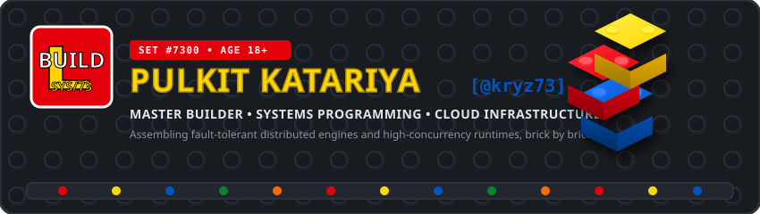
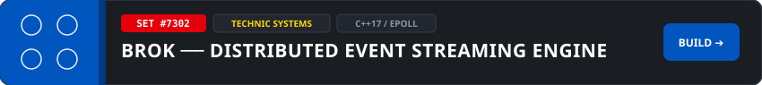
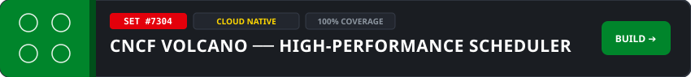

<!--
**kryz73/kryz73** is a ✨ _special_ ✨ repository because its `README.md` (this file) appears on your GitHub profile.

Here are some ideas to get you started:

- 🔭 I’m currently working on ...
- 🌱 I’m currently learning ...
- 👯 I’m looking to collaborate on ...
- 🤔 I’m looking for help with ...
- 💬 Ask me about ...
- 📫 How to reach me: ...
- 😄 Pronouns: ...
- ⚡ Fun fact: ...
-->
<div align="center">

  <!-- 3D Isometric LEGO Banner -->
  

  <br/><br/>

  <!-- Dynamic Typing LED Header -->
  

  <br/>

  <!-- Tactile LEGO Stud Badges -->
  <a href="https://github.com/kryz73"></a>
  <a href="#-the-builder-blueprint"></a>
  <a href="https://github.com/kryz73"></a>
  <a href="#-masterpiece-sets-featured-projects"></a>

  <br/><br/>
  

</div>

---

### 📖 `The Builder's Instruction Booklet`

```
  ┌─────────────────────────────────────────────────────────────────────────────┐
  │  BUILDER BLUEPRINT : PULKIT KATARIYA [@kryz73]                              │
  ├─────────────────────────────────────────────────────────────────────────────┤
  │  • WORKSHOP BASE  : IIITM Gwalior — B.Tech Mathematics & Computing ('28)    │
  │  • CORE SPECIALTY : Systems Programming · High Concurrency · Clean APIs     │
  │  • CERTIFICATION  : WorldQuant University [Applied Data Science Lab]        │
  │  • GUILD LEAD     : Founder & Executive Lead @ AXIS (AI & Systems Society)  │
  │  • PHILOSOPHY     : "Every massive machine is just interlocking bricks."    │
  └─────────────────────────────────────────────────────────────────────────────┘
```

> 🧱 **The Master Builder's Code:**  
> Whether architecting a 9-domain modular ERP, wiring a high-throughput C++17 message broker with Linux `epoll`, or validating Kubernetes batch scheduling state machines with 100% test coverage—great software isn't magic. It's built with high-precision components that snap together with zero friction.

---

### 🧰 `The Master Brickbox (Parts & Tech Stack)`

<p align="center"><em>All components sorted by brick mold and function:</em></p>

<!-- Tray 1: Languages -->


<div align="center">


</div>

<br/>

<!-- Tray 2: Backend & Systems -->


<div align="center">


</div>

<br/>

<!-- Tray 3: Frontend & Web UI -->


<div align="center">


</div>

<br/>

<!-- Tray 4: DevOps & Cloud -->


<div align="center">


</div>

<br/>

<!-- Tray 5: AI & Data Science -->


<div align="center">


</div>

<br/>
<div align="center">
  
</div>

---

### 🏗️ `Masterpiece Sets (Featured Projects)`

<p align="center"><em>Click on any build set box to inspect blueprints and code:</em></p>

<!-- SET 1: ACAD-ERP -->
<a href="https://github.com/kryz73/acad-erp">
  
</a>

```yaml
Set ID        : #7301 [Architecture Series]
Pieces (Stack): Next.js 14 · TypeScript · FastAPI · Strawberry GraphQL · PostgreSQL · Docker
Blueprint     : https://github.com/kryz73/acad-erp
Build Specs   :
  🧱 Modular Assembly    : Unites 9 distinct enterprise domain modules under a single architecture.
  🧱 GraphQL API Layer   : Implements strict Domain-Driven Design (DDD) with Strawberry GraphQL.
  🧱 Security Interlock  : Zero-trust RBAC engine using JWT, live role hydration & Argon2 password hashing.
  🧱 Dual-Face Portals   : Role-gated frontend built in Next.js 14 & Tailwind CSS for Admin, Faculty, & Student.
```

<br/>

<!-- SET 2: BROK -->
<a href="https://github.com/kryz73/brok">
  
</a>

```yaml
Set ID        : #7302 [Technic Distributed Systems Series]
Pieces (Stack): C++17 · Linux epoll · Binary TCP Sockets · Concurrency · CMake
Blueprint     : https://github.com/kryz73/brok
Build Specs   :
  🧱 Storage Engine      : Partitioned append-only commit logs and index files with O(1) offset lookups.
  🧱 Network Reactor     : Non-blocking event-driven reactor on Linux epoll using a custom binary TCP wire protocol.
  🧱 Cluster Replication : Leader-follower partition replication with In-Sync Replicas (ISR) & heartbeat ping.
  🧱 Micro-Footprint     : Engineered to operate within a lean ~4MB memory footprint under peak streaming load.
```

<br/>

<!-- SET 3: URL SHORTENER -->
<a href="https://github.com/kryz73/url-shortner">
  
</a>

```yaml
Set ID        : #7303 [Speed Champions Microservice Series]
Pieces (Stack): Go · Chi Router · Redis · PostgreSQL · Docker · Nginx · GitHub Actions
Blueprint     : https://github.com/kryz73/url-shortner
Build Specs   :
  🧱 Cache-Aside Reactor : Redis caching strategy delivering sub-millisecond p95 redirection latency.
  🧱 Key Transformation  : Collision-free Base62 encoder translating 64-bit auto-increment DB IDs into shortcodes.
  🧱 Connection Pooling  : High-throughput pgxpool persistence with B-Tree indexes on indexed shortcodes.
  🧱 Production Deploy   : Multi-stage Docker packaging behind an Nginx reverse proxy with automated CI/CD.
```

<br/>

<!-- SET 4: CNCF VOLCANO -->
<a href="https://github.com/volcano-sh/volcano">
  
</a>

```yaml
Set ID        : #7304 [Cloud-Native Assembly Series]
Pieces (Stack): Go · Kubernetes Internals · CNCF Incubating · Table-Driven Testing
Blueprint     : https://github.com/volcano-sh/volcano
Build Specs   :
  🧱 Queue State Engine  : Authored comprehensive table-driven Go test suites for all queue lifecycle transitions.
  🧱 Job Controller Core : Verified state machine transitions (Pending -> Running -> Restarting -> Aborting).
  🧱 100% Statement Cov  : Achieved complete code coverage across core controllers to prevent scheduling regressions.
```

<br/>
<div align="center">
  
</div>

---

### 🏛️ `The Builders' Guild (Community & Leadership)`

<table border="0">
  <tr>
    <td width="90" align="center" valign="middle">
      
    </td>
    <td>
      <h3>🧱 AI Exploration and Innovation Society (AXIS)</h3>
      <strong>Founder & Executive Lead</strong> • <em>IIITM Gwalior</em><br/>
      Founded our departmental student guild dedicated to demystifying artificial intelligence, systems programming, and high-scale architecture. Leading technical workshops, collaborative build sprints, and peer-to-peer open source mentoring sessions.
    </td>
  </tr>
</table>

---

### 📊 `Brick Counting & Telemetry`

<div align="center">

<!-- GitHub Stats with LEGO Palette -->


<br/>


</div>

---

### 📬 `Snap In & Assemble a Collab!`

<div align="center">

> *"Everything is awesome when we're building together!"* 🎶  
> Have an ambitious systems project, distributed architecture challenge, or open-source build in mind? Let's connect!

<br/>

<a href="https://www.linkedin.com/in/pulkit-katariya-888a86323/"></a>
<a href="mailto:pulkit.kr1924@gmail.com"></a>
<a href="https://github.com/kryz73"></a>

<br/><br/>

```text
  🧱 [ BUILD COMPLETE // READY TO DEPLOY TO GITHUB.COM/KRYZ73 ] 🧱
```

</div>
